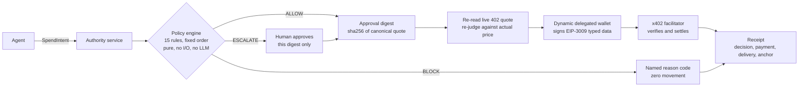

<div align="center">


# Ambit

**The agent proposes. The policy decides. Nothing moves until it passes.**

</div>

<div align="center">


</div>

Funding an agent today means handing it a wallet and hoping. The only real control is the balance,
and a balance answers exactly one question: *can this transaction clear?* It cannot tell you whether
the vendor is trusted, whether you already bought this, or who authorised it. That is a blast
radius, not a control.

Ambit puts a decision in front of the money. Fifteen deterministic rules judge every spend an agent
proposes, before anything is signed, and the rule that refuses goes on the record.

**Propose. Judge. Sign one exact digest. Settle only that.**

[Demo video](#demo) · [Live app](https://www.ambit.surf) · [Evidence](#live-evidence) · [Verify it yourself](#verify-it-yourself) · [Run locally](#run-locally)

> **Stage: hackathon build, testnet only.** One real payment has settled, on Base Sepolia, through a
> project-operated seller. Storage is in memory and clears on restart. Route-level authentication is
> an asserted header, not a signature. During an active delegation Ambit holds a signing share, so it
> is **custodial and not trustless**. Two of the fifteen rules are present but not enforced, and are
> labelled as such everywhere they appear. Nothing below is claimed beyond what
> [`evidence/`](evidence/) supports.

## Demo

<!-- Replace with the recorded walkthrough before submission. -->
> **Not yet recorded.** The walkthrough covering sign-in, delegation, an allowed payment and a live
> refusal will be embedded here.

## Explore without a wallet

Every page below is public, requires no account, and asserts nothing that the repository cannot
back. This is the path a reviewer can take in three minutes.

| Where | What you see | Needs a wallet |
|---|---|---|
| [`/`](https://www.ambit.surf/) | The argument, the mechanism, and what is deliberately not built | No |
| [`/explorer`](https://www.ambit.surf/explorer) | The adversarial campaign with every case and its **real** outcome, including the one not run | No |
| [`/docs`](https://www.ambit.surf/docs) | How the whole thing works, in plain language | No |
| [`/receipt/[intentId]`](https://www.ambit.surf/explorer) | Decision, payment, delivery and anchor as four separate facts | No |
| [`/console/*`](https://www.ambit.surf/console) | Policy editor, decision stream, wallet controls | Yes, Dynamic sign-in |

## Contents

- [Why this exists](#why-this-exists)
- [Architecture](#architecture)
- [The mechanism, step by step](#the-mechanism-step-by-step)
- [Live evidence](#live-evidence)
- [Verify it yourself](#verify-it-yourself)
- [What is real and what is not](#what-is-real-and-what-is-not)
- [Engineering decisions and the hard problems](#engineering-decisions-and-the-hard-problems)
- [Repository map](#repository-map)
- [Run locally](#run-locally)
- [Trust boundaries and limitations](#trust-boundaries-and-limitations)
- [Attribution and further reading](#attribution-and-further-reading)

## Why this exists

An agent with a funded wallet can answer one question. Here are six it cannot:

| Question | A balance's answer |
|---|---|
| Is this vendor one we trust? | — |
| Have we already bought this? | — |
| Is this within the per-call cap the human set? | — |
| Is this the eleventh identical call in a minute? | — |
| Did the thing we paid for actually arrive? | — |
| Who authorised this, and can they prove it? | — |

The two obvious fixes both fail. **Give it a small wallet** bounds the damage and explains nothing:
a $50 wallet still buys the same domain eleven times and still produces no record of who authorised
what. **Let the model check its own limits** puts the check inside the thing being defended against.
Prompt injection, hallucinated tool arguments and runaway loops all originate in the model, so a
check the model performs is a check the attacker controls.

The decision has to sit somewhere the model cannot reach. That is what Ambit is.

*From Latin* ambitus, *"a going around": in law, the bounded scope within which an authority
operates. A statute's ambit is exactly what it may reach and nothing further.*

## Architecture



The user owns the wallet throughout. Ambit holds a delegated signing share that the user granted and
can revoke unilaterally; on revocation Dynamic fires a webhook, Ambit **deletes** the credentials,
and every later request returns `403 DELEGATION_REVOKED`.

## The mechanism, step by step

**1. Propose.** An agent submits a bounded `SpendIntent`: provider, capability, amount, asset,
network, recipient, category. It can propose anything at all.

**2. Judge.** The policy engine evaluates all fifteen rules in a fixed order, as a pure function of
`(intent, policy, decisionWindow)`. No I/O, no network, no model. Every rule runs on every call with
no short-circuit, so the receipt shows the full evaluation rather than the first failure only. The
first `FAIL` in order attributes the verdict.

**3. Allow, escalate or block.** `BLOCK` returns a named reason code and moves nothing. `ESCALATE`
routes one digest to a human. `ALLOW` mints the approval digest:

```
quoteHash = sha256(RFC 8785 canonical JSON of the quote)
digest    = sha256(canon({ quoteHash, amount, recipient, policyId, policyHash,
                           requesterPrincipal, walletId, nonce, expiresAt }))
```

An approval does not authorise "a purchase". It authorises **one hash**. Change the amount, the
recipient, the TTL, the item or the wallet and the digest changes, so the approval no longer applies
and execution refuses with `DIGEST_MISMATCH`. **There is no path where a human approves $5 and $500
leaves.**

**4. Re-read the real price.** At execution Ambit reads the live x402 challenge and re-runs all
fifteen rules against *the provider's actual quote*, not the agent's estimate. This is not a
formality: see the live evidence below, where an agent proposed 0.07 and the chain moved 0.05.

**5. Sign.** `delegatedSignTypedData` signs an EIP-3009 `transferWithAuthorization` as EIP-712 typed
data, using the user's delegated share. Exact amount, exact recipient, single-use nonce, expiring.
`approve` is never called on any ERC-20, so **no standing allowance exists for anyone to drain**.
That is a property of the rail, not a rule anyone has to remember.

**6. Settle.** An x402 facilitator verifies and submits. Ambit never broadcasts. If no facilitator
is configured the seller route **refuses with a named reason** rather than accepting the payment on
trust and fabricating a hash.

**7. Receipt.** Decision, payment, delivery and anchor recorded as four separate facts, deliberately
not collapsed into one status.

## Live evidence

One row per property, each backed by something a reader can check independently.

| Property | Level | Evidence |
|---|---|---|
| An in-policy request produces a real payment | `LIVE_TESTNET` | [`0x955a49dd…d215b718`](https://sepolia.basescan.org/tx/0x955a49dd96c8990f6e3c0c386a98f4a8b90ba9d70682fa072cf32f50d215b718) · block 46988167 · 0.050000 USDC |
| The payer is the user's own Dynamic wallet | `LIVE_TESTNET` | [`0x14F4B95B…78eCF51`](https://sepolia.basescan.org/address/0x14f4b95ba8fc265c49d2ca16fb8673da578ecf51) |
| The asset is real USDC on Base Sepolia | `LIVE_TESTNET` | [`0x036CbD53…8f3dCF7e`](https://sepolia.basescan.org/token/0x036CbD53842c5426634e7929541eC2318f3dCF7e) |
| The agent cannot overpay past the real price | `LIVE_TESTNET` | Proposed 0.07, settled 0.05. [Full account](evidence/payments/g4-first-settlement-2026-09-18.md) |
| An out-of-policy request refuses with zero movement | `INTEGRATION_TESTED` | [campaign output](evidence/campaign/) |
| A mutated digest is refused at execution | `INTEGRATION_TESTED` | case C3, [campaign output](evidence/campaign/) |
| Revocation stops the agent | `INTEGRATION_TESTED` | case C9 → `403 DELEGATION_REVOKED` |
| Every Dynamic SDK call site is real on the pinned version | `INTEGRATION_TESTED` | [`SURFACE.md`](.agents/skills/dynamic/SURFACE.md), with `dist` shasums |
| The policy engine is a pure function | `UNIT_TESTED` | [`packages/policy-engine`](packages/policy-engine/) |
| No standing allowance exists | `UNIT_TESTED` | `approve` appears nowhere in the payment path |
| Delivery verified against an independent source | **`NOT_YET_PROVEN`** | Phase 2. Receipts say `T0_NONE` rather than quietly downgrading |

[`docs/claims.md`](docs/claims.md) is generated from [`evidence/claims.json`](evidence/claims.json)
and never hand-edited. `pnpm claims` fails the build if a claim exceeds its evidence. Anything at
`LIVE_TESTNET` or above must carry a transaction hash a reader can open.

### How this could be misleading

Written here before anyone has to ask:

- The campaign runs against **one provider on one rail**. A second could behave differently.
- Blocked cases prove the engine **refuses**, not that the refusal set is **complete**.
- Determinism is reported as **10 runs**, not as a property.
- The Ambit-operated seller is labelled `PROJECT_OPERATED` everywhere and is **not evidence of
  third-party adoption**.
- Cases recorded as `NOT_ATTEMPTED` were not run. They are neither passes nor failures.

## Verify it yourself

Working from a clean clone, no credentials needed:

```bash
git clone https://github.com/Dotman-Bei/Ambit.git && cd Ambit
pnpm install

pnpm test          # 171 tests, including fast-check property tests on the engine
pnpm typecheck
pnpm campaign      # the adversarial campaign → evidence/campaign/
pnpm claims        # regenerates docs/claims.md; fails if a claim exceeds its evidence
```

`pnpm campaign` runs every case in the table against the real engine and writes **what actually
happened**, including failures. It never simulates a payment: without a facilitator configured, the
live-rail case is recorded as `NOT_ATTEMPTED_IN_CAMPAIGN` rather than reported as a pass.

Check the settled payment without cloning anything:

```bash
curl -s "https://sepolia.basescan.org/tx/0x955a49dd96c8990f6e3c0c386a98f4a8b90ba9d70682fa072cf32f50d215b718"
```

## What is real and what is not

| | Status |
|---|---|
| 15-rule policy engine, pure, fixed order | **Real.** 13 enforced; rules 8 and 14 return `RULE_NOT_ENFORCED` and are labelled in the UI and on receipts |
| Approval digests over RFC 8785 canonical JSON | **Real** |
| Dynamic delegated access, grant and revoke | **Real**, end to end, including the encrypted webhook |
| EIP-3009 payment signing | **Real.** `delegatedSignTypedData`, one settled transaction |
| x402 challenge parsing and settlement | **Real** through an external facilitator |
| The seller being paid | **Project-operated.** A real x402 seller, labelled `PROJECT_OPERATED` everywhere. Not third-party adoption |
| Receipts | **Real**, and unanchored. Anchor state is `NOT_RECORDED` with a reason |
| Delivery verification | **Partial.** Tiers exist; no independent source is wired, so receipts say `T0_NONE` |
| Escalation to a human | **Route exists**, writer not wired. Surfaces as `APPROVAL_PATH_NOT_READY` rather than an empty inbox |
| Storage | **In-memory.** Restarting clears decisions, pauses and credentials |
| Route authentication | **Header, not signature.** See D-009 |

Nothing is mocked behind a passing façade. Where a capability is absent it refuses with a named
reason and says so in `GET /health` and in the console.

## Engineering decisions and the hard problems

Full write-ups in [`DECISIONS.md`](DECISIONS.md). The ones that shaped the build:

**D-001. The SDK surface was verified against published types, not documentation.** Every Dynamic
call site was read out of the shipped `.d.ts` and pinned with `dist` shasums. Prose docs drift; type
declarations are what actually runs.

**D-003. The payment leg signs typed data, not a transaction.** x402 `exact` settlement is an
EIP-3009 authorization the *facilitator* submits. Ambit never broadcasts, so
`delegatedSignTransaction` is never called. This is the single most load-bearing SDK fact in the
build, and getting it wrong would have produced a plausible-looking dead end.

**D-004. Rule 15's failure maps to `ESCALATE`, not `BLOCK`.** Needing a human is not a refusal, and
collapsing the two would make the receipt lie about what happened.

**D-005. All fifteen rules evaluate on every call, with no short-circuit.** Slower, and correct: the
receipt shows the whole evaluation rather than only the first thing that failed.

**D-006. The reservation id is derived, not random.** Campaign case C10 asserts identical verdicts
across ten runs. A random id would make determinism untestable.

**D-008. Revocation is a delete, not a flag.** A revoked-but-retained credential is a credential.

**D-009. Phase 1 authentication is a header, and this README says so.** The owner is asserted rather
than proved. It is the largest known gap and it is documented rather than hidden.

### Two bugs worth recording

**A client bug wearing the costume of a provider failure.** `new URL("/settle", base)` silently drops
a path prefix, so `https://x402.org/facilitator` became `https://x402.org/settle`. The request hit a
marketing page, returned HTML, and the JSON parse error surfaced as `PROVIDER_REJECTED_PAYMENT`. The
settle URL is now joined by trimming and concatenating, and the facilitator response is read as text
first so a proxy error page is reported as what it is.

**Read the error body first.** Four debugging cycles went into a bare `403 Forbidden` from the SDK,
whose response body was an unread `ReadableStream`. Reading it gave
`{"error":"Insufficient scope permissions"}`, a token scope problem, diagnosable in one step.

## Repository map

```
packages/
  canon/            RFC 8785 canonical JSON + sha256, everything the digest depends on
  shared/           types, reason codes, zod schemas, exact decimal↔atomic conversion
  policy-engine/    THE 15 RULES. pure, no I/O, returns a proposal
  approval/         digest construction, binding, mutation rejection
  policy-store/     append-only records, owner scoping, reservation accounting
  payments-x402/    challenge parsing, EIP-3009 authorization, the payment client
  proof-engine/     delivery verification tiers
  receipts/         receipt assembly + public field allowlist
  ambit-sdk/        the installable client surface
services/authority/ Hono API: /propose /decide /execute /webhooks/dynamic + the seller route
apps/web/           Next.js: landing, docs, explorer, console, receipt, approve
evidence/           campaign output, payment record, and the claim ledger
docs/               generated claim ledger, ADRs, kill criteria
engineering/        the two de-risking spikes, with their LOCK conditions
```

## Run locally

```bash
pnpm install
pnpm hooks:install          # pre-commit secret scan
cp .env.example .env        # fill in the Dynamic values

pnpm dev:authority          # authority :4020, PROJECT_OPERATED seller :4021
pnpm dev:web                # console :3000
```

With an empty `.env` the service starts and **refuses to move money**, by design. Every blocked
capability is labelled in `GET /health` and in the console rather than hidden behind a substitute.
Only the exact strings `1` and `true` enable anything: a typo, an empty string, `false`, `yes`, `on`
or unset all mean off, because a flag that guesses at intent can be switched on by accident, and
this one gates whether money can move.

### Delegation keypair

```bash
mkdir -p internal
openssl genrsa -out internal/delegation_private.pem 4096
openssl rsa -in internal/delegation_private.pem -pubout -out internal/delegation_public.pem
openssl rand -base64 32          # CREDENTIAL_ENCRYPTION_KEY
```

The **public** half goes in the Dynamic dashboard. The private half goes in
`DELEGATION_PRIVATE_KEY` and never in git. `internal/` and `*.pem` are gitignored and the
pre-commit hook scans for `-----BEGIN`.

## Trust boundaries and limitations

Full text in [`LIMITATIONS.md`](LIMITATIONS.md) and [`SECURITY.md`](SECURITY.md). The boundaries that
matter:

1. **Ambit is custodial during an active delegation.** It holds a signing share. It cannot move funds
   outside policy and cannot move them after revocation, but it is **not trustless**.
2. **Compromise of the Ambit server is total** for every active delegation. Documented, not minimised.
3. **The refusal set is not complete.** An attack not in the campaign is not covered by the campaign.
4. **Rules 8 and 14 are not enforced.** Present, returning `RULE_NOT_ENFORCED`, labelled everywhere,
   never silently passing.
5. **Delivery verification is not universal.** Provider attestation is never presented as independent.
6. **One provider, one rail, one asset.** USDC on Base Sepolia.
7. **Receipts are unanchored.** Anchoring is publication, not truth; the record is authoritative
   regardless, and the anchor state says `NOT_RECORDED` with a reason.
8. **Policy correctness is the user's.** Ambit enforces the policy it is given.

## Attribution and further reading

Built for the Runtime Hackathon, Dynamic track. Wallet infrastructure by
[Dynamic](https://dynamic.xyz) (delegated access); payments over
[x402](https://github.com/coinbase/x402) with EIP-3009 settlement on Base Sepolia.

| Document | What is in it |
|---|---|
| [`DECISIONS.md`](DECISIONS.md) | Ten architectural decisions with their alternatives and costs |
| [`LIMITATIONS.md`](LIMITATIONS.md) | What is deliberately not claimed, and why |
| [`SECURITY.md`](SECURITY.md) | Trust boundaries and open issues |
| [`BUILD_LOG.md`](BUILD_LOG.md) | What was built, in order, including what went wrong |
| [`docs/claims.md`](docs/claims.md) | Generated claim ledger with proof levels |
| [`docs/kill-criteria.md`](docs/kill-criteria.md) | The conditions under which this would have been abandoned |

No token is launched. No secret appears anywhere in this repository.

> Ambit does not claim an agent is safe to fund. It makes the decision to fund impossible to fake,
> records exactly how far the proof reaches, and refuses to say a word past it.
